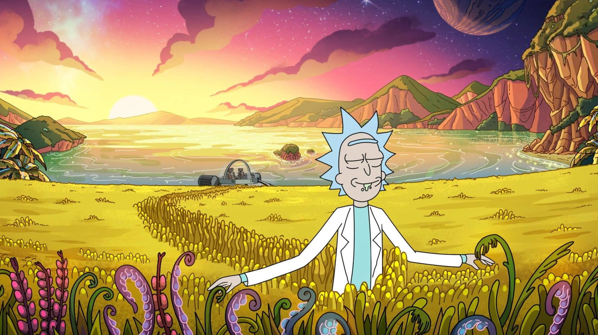

<h1 align="center">Saudações <h1>

 

### Sobre mim
- Um jovem de apenas 14 anos entusiasmado e apaixonado pela programação.
- Meu foco no momento é estudar as linguagens iniciais da programação web. (HTML, CSS, JS);

